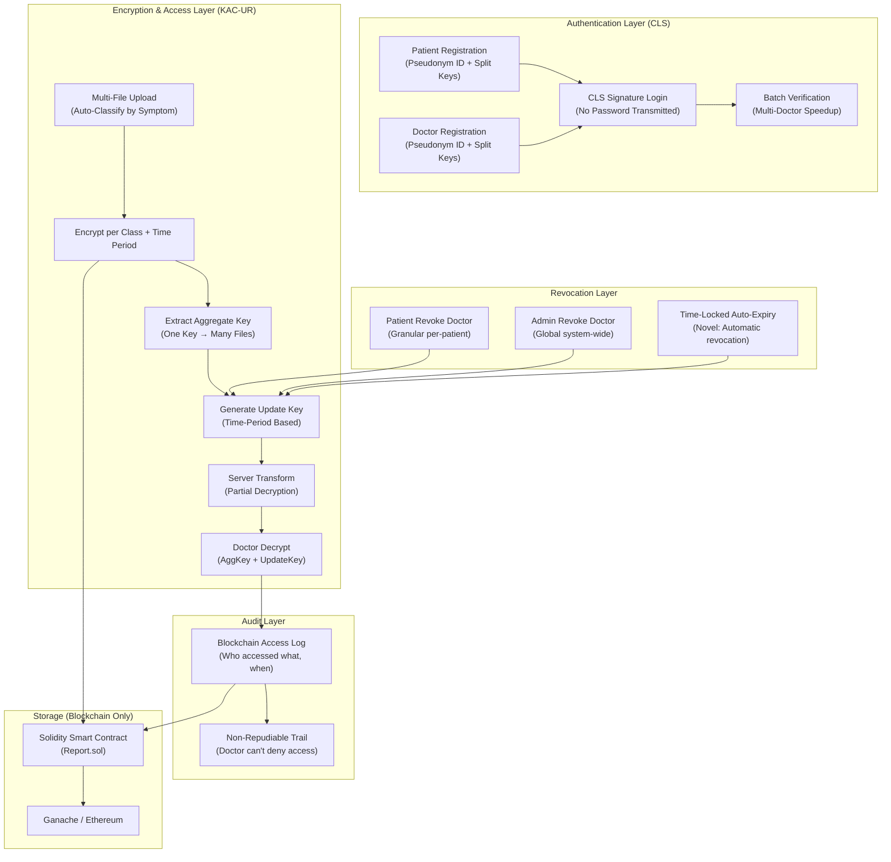

# Final Implementation Plan — Blockchain Healthcare Framework
### Features: CLS Anonymous Auth + KAC-UR Revocation + Batch Verification + Auto-Expiry + Multi-File + Audit Logging

**Research Papers Referenced:**
1. **KAC-UR**: Liu et al., "Efficient Key-Aggregate Cryptosystem With User Revocation", IEEE TKDE, Nov 2024
2. **BCCA**: Wang et al., "Blockchain-Based Certificateless Conditional Anonymous Authentication for IIoT", IEEE Systems Journal, Mar 2024
3. **CLS-Healthcare**: Qiao et al., "A Provably Secure Certificateless Signature Scheme With Anonymity for Healthcare IIoT", IEEE IoT Journal, Jul 2025

---

## System Architecture



---

## Feature 1: CLS Anonymous Authentication with Batch Verification

### Current Problem
In `app.py`, login routes (`PatientLoginAction` line 412, `DoctorLoginAction` line 466) send plaintext username + password to the server, which compares them against blockchain records. No anonymity, no cryptographic proof.

### Solution: Certificateless Signature (CLS)

**From Qiao et al. (CLS-Healthcare):**
- User's private key = `SK = (x, d)` where `x` is user-chosen, `d` is generated by system (KGC)
- Pseudonym identity: `ID = RID ⊕ H₀(rPpub, Vt)` with validity period `Vt`
- Signature: `σ = h₄t + h₃d + h₂x` (random `t` per session)
- Verification: `σP = h₄T + h₃(R + h₁Ppub) + h₂X`

**From BCCA (Wang et al.) — Batch Verification:**
- When `n` users authenticate simultaneously, instead of verifying `n` signatures individually, verify all at once:
  ```
  (Σσᵢ)·P = Σ[h₄ᵢTᵢ + h₃ᵢ(Rᵢ + h₁ᵢPpub) + h₂ᵢXᵢ]
  ```
- Reduces verification time from `O(n)` to `O(1)` — critical when multiple doctors log in during shift changes

### Algorithm → Code Mapping

| Algorithm | Function | Description |
|---|---|---|
| `Setup(κ)` | `cls_setup()` | Generate ECC group `G`, generator `P`, master key `s`, public key `Ppub = sP` |
| `Partial-Private-Key(RID, X)` | `generate_partial_key(real_id, user_pub)` | KGC computes `d = r + s·H₁(Ppub, ID, R, X)`, returns `(d, R)` |
| `Pseudonym-ID` | `generate_pseudonym(real_id, r)` | Compute `ID = RID ⊕ H₀(rPpub, Vt)` — real identity hidden |
| `Key-Gen` | `set_keys(x, d)` | Set `SK = (x, d)`, `PK = (X, R)` |
| `Sign(m, SK)` | `sign_message(message, sk)` | Pick random `t`, compute `σ = h₄t + h₃d + h₂x` |
| `Verify(σ, PK, m)` | `verify_signature(sigma, pk, message)` | Check `σP = h₄T + h₃(R+h₁Ppub) + h₂X` |
| `Batch-Verify` | `batch_verify(signatures[])` | Check `(Σσᵢ)P = Σ[h₄ᵢTᵢ + ...]` in one operation |
| `Mutual-Auth` | `mutual_authenticate(patient, doctor)` | Qiao et al. Section VI-B: DH key agreement after mutual CLS verification |

### Integration Points in `app.py`

| Current Route | What Changes |
|---|---|
| `PatientSignupAction` (line 385) | User generates `(x, X)` → server generates `(d, R, ID)` → stores `(ID, PK)` on blockchain |
| `AddDoctorAction` (line 438) | Same CLS registration for doctors |
| `PatientLoginAction` (line 412) | User sends CLS signature `σ` → server calls `verify_signature()` → no password ever transmitted |
| `DoctorLoginAction` (line 466) | Same CLS verification for doctors |

---

## Feature 2: KAC-UR Encryption with Multi-File & Auto-Classification

### Current Problem
In `app.py`, all files are encrypted with a single shared AES key (`ENCRYPTION_KEY_B64`, line 21). No per-file granularity, no selective sharing, no revocation.

### Solution: Key-Aggregate Cryptosystem with User Revocation (KAC-UR)

**Data Class Auto-Classification:**
When a patient uploads files, the system assigns a **data class** based on the symptoms/category:

```python
DATA_CLASSES = {
    1: "Hematology",      # blood reports, CBC
    2: "Radiology",       # MRI, CT, X-Ray
    3: "Cardiology",      # ECG, Echo
    4: "Gastroenterology", # liver, digestive
    5: "Nephrology",      # kidney
    6: "Oncology",        # cancer reports
    7: "Pulmonology",     # respiratory, lung
    8: "General",         # prescriptions, vaccination
    9: "Neurology",       # brain, nerve
    10: "Orthopedics"     # bone, joint
}

def classify_symptoms(symptoms_text):
    """Auto-assign data class from symptom keywords"""
    keywords = {
        "blood": 1, "cbc": 1, "hemoglobin": 1,
        "mri": 2, "ct scan": 2, "x-ray": 2, "xray": 2,
        "heart": 3, "chest pain": 3, "ecg": 3, "cardiac": 3,
        "liver": 4, "stomach": 4, "digestive": 4,
        "kidney": 5, "renal": 5,
        "tumor": 6, "cancer": 6, "oncology": 6,
        "lung": 7, "breathing": 7, "respiratory": 7, "cough": 7,
        "fever": 8, "general": 8, "vaccination": 8,
        "brain": 9, "nerve": 9, "headache": 9,
        "bone": 10, "joint": 10, "fracture": 10,
    }
    # Match first keyword found
    for keyword, cls in keywords.items():
        if keyword in symptoms_text.lower():
            return cls
    return 8  # Default: General
```

**Multi-File Upload Flow:**
```
Patient uploads 3 files with symptoms "chest pain, breathing difficulty":
├── ecg_report.pdf    → Auto-classified: Class 3 (Cardiology)
├── lung_xray.pdf     → Auto-classified: Class 7 (Pulmonology)  
└── prescription.pdf  → Auto-classified: Class 8 (General)

Patient shares with:
├── Cardiologist Dr. A → AggKey covers [3, 8] → can decrypt ecg + prescription
└── Pulmonologist Dr. B → AggKey covers [7, 8] → can decrypt xray + prescription

ONE compact key per doctor, regardless of file count.
```

### Algorithm → Code Mapping

| Paper Algorithm (Liu et al. Section IV-B) | Function | Description |
|---|---|---|
| `Sys(1λ, n)` | `system_setup(n_classes=10)` | Generate system params for `n` data classes |
| `Setup(T₀)` | `owner_setup(patient_id)` | Generate `MSK=(w,y)`, `MPK=(gʷ,gʸ)`, init time `T₀` |
| `Enc(MPK, PKⱼ, l, M)` | `encrypt_report(data, class, time)` | Encrypt file under class `l` and time period `Tⱼ` |
| `Extract(MSK, uᵢ, Sᵢ)` | `extract_aggregate_key(doctor, classes[])` | ONE key covering multiple classes using polynomial `qᵢ(0)=w` |
| `Update(Tⱼ)` | `advance_time_period()` | New time period → new secret `tⱼ` |
| `KeyUp(MSK, SKⱼ, RLⱼ, uᵢ, Sᵢ)` | `generate_update_key(patient, doctor, time)` | Time-period key; returns `None` if revoked |
| `Transform(kuⱼ, CTⱼₗ)` | `server_transform(update_key, ciphertext)` | Server partially decrypts (reduces doctor's compute load) |
| `Dec(KS,u, CT'ⱼₗ)` | `user_decrypt(agg_key, partial_ct)` | Doctor's final decryption |
| `Revoke(RLⱼ₋₁, Tⱼ, RIⱼ)` | `revoke_user(patient, doctor)` | Add to revocation list, delete old update keys |

### Integration Points in `app.py`

| Current Route | What Changes |
|---|---|
| `AddHealthAction` (line 297) | Accept multiple files via `request.files.getlist()` → auto-classify each → encrypt with `encrypt_report()` per class → generate aggregate keys for selected hospitals |
| `ViewPatientReport` (line 217) | Check revocation → fetch update key → `server_transform()` → `user_decrypt()` |
| `download_report` (line 576) | Same decrypt pipeline with revocation check before serving file |

---

## Feature 3: Dual-Layer Revocation + Time-Locked Auto-Expiry (Novel)

### Revocation Design

**Layer 1 — Patient Revocation (Granular):**
- Patient stops generating `UpdateKey` for a specific doctor for their own files
- Other patients' files remain accessible to that doctor

**Layer 2 — Admin Revocation (Global):**
- Admin blacklists a doctor system-wide
- ALL patients' files become inaccessible

**Layer 3 — Time-Locked Auto-Expiry (Novel Addition):**
- When sharing, the patient sets an **access duration** (e.g., 7 days, 30 days)
- The system records `expiry_time = current_time + duration`
- During `generate_update_key()`, the system checks: `if current_time > expiry_time → revoked`
- **No manual intervention needed** — access automatically expires

```python
def generate_update_key(self, patient_id, doctor_id, time_period):
    # Layer 1: Check patient-level revocation
    if self.is_patient_revoked(patient_id, doctor_id):
        return None  # DENIED
    
    # Layer 2: Check admin global revocation
    if self.is_globally_revoked(doctor_id):
        return None  # DENIED
    
    # Layer 3: Check time-locked auto-expiry (NOVEL)
    if self.is_access_expired(patient_id, doctor_id):
        return None  # DENIED — access window has passed
    
    # All checks passed → generate valid update key
    return self._compute_update_key(patient_id, doctor_id, time_period)
```

### New Routes in `app.py`

```python
# Patient revokes a specific doctor
@app.route('/PatientRevokeDoctorAction', methods=['POST'])
def PatientRevokeDoctorAction():
    doctor = request.form['doctor_name']
    data = f"patient_revoke#{userid}#{doctor}#{date.today()}"
    saveDataBlockChain(data, "revocation")
    kac_engine.revoke_user(userid, doctor)
    return render_template('PatientScreen.html', 
                          data=f'Access revoked for {doctor}')

# Admin globally blacklists a doctor
@app.route('/AdminRevokeDoctorAction', methods=['POST'])
def AdminRevokeDoctorAction():
    doctor = request.form['doctor_name']
    data = f"admin_revoke#{doctor}#{date.today()}"
    saveDataBlockChain(data, "revocation")
    kac_engine.admin_revoke_user(doctor)
    return render_template('AdminScreen.html', 
                          data=f'{doctor} globally revoked')
```

---

## Feature 4: Audit-Proof Access Logging (Novel)

Every time a doctor accesses a patient's file through the KAC-UR decrypt pipeline, an **immutable audit log** is recorded on the blockchain:

```python
def log_access(patient_id, doctor_id, file_class, timestamp):
    """Record on blockchain — doctor cannot deny this access"""
    log_entry = f"access_log#{patient_id}#{doctor_id}#{file_class}#{timestamp}"
    # CLS-signed by the doctor's key for non-repudiation
    signature = cls_engine.sign_message(log_entry, doctor_sk)
    saveDataBlockChain(f"{log_entry}#{signature}", "audit")
```

**Patient can view their access log:**
```python
@app.route('/ViewAccessLog', methods=['GET'])
def ViewAccessLog():
    """Patient sees who accessed their files and when"""
    logs = get_rows("audit")
    # Filter logs for current patient, display in table
```

---

## Smart Contract Changes

#### [MODIFY] [Report.sol](file:///c:/Users/kalya/Downloads/blockchain-based-anonymous-authentication-framework-for-healthcare/contracts/Report.sol)

```diff
 contract Report {
     string public hospital_details;
     string public patient_details;
     string public prescription;
+    string public revocation_details;
+    string public audit_log;
+    uint256 public currentTimePeriod;
     
+    function setRevocation(string memory rd) public {
+        revocation_details = rd;
+    }
+    function getRevocation() public view returns (string memory) {
+        return revocation_details;
+    }
+    function setAuditLog(string memory al) public {
+        audit_log = al;
+    }
+    function getAuditLog() public view returns (string memory) {
+        return audit_log;
+    }
+    function advanceTimePeriod() public {
+        currentTimePeriod += 1;
+    }
+    function getTimePeriod() public view returns (uint256) {
+        return currentTimePeriod;
+    }
```

---

## New Files Summary

| File | Purpose | Key Functions |
|---|---|---|
| `cls_auth.py` | CLS anonymous authentication module | `cls_setup()`, `generate_partial_key()`, `generate_pseudonym()`, `sign_message()`, `verify_signature()`, `batch_verify()`, `mutual_authenticate()` |
| `kac_crypto.py` | KAC-UR encryption + revocation module | `system_setup()`, `encrypt_report()`, `extract_aggregate_key()`, `generate_update_key()`, `server_transform()`, `user_decrypt()`, `revoke_user()`, `admin_revoke_user()` |
| `cls_demo.py` | Standalone CLS auth demo | Proves registration, login, batch verification work |
| `kac_ur_demo.py` | Standalone KAC-UR demo (update existing) | Proves multi-file encryption, aggregate keys, dual revocation, auto-expiry work |

---

## Implementation Phases

### Phase 1: Standalone Demos (Verify Crypto)
- Create `cls_demo.py` → run → verify signature generation/verification + batch verify + pseudonym
- Update `kac_ur_demo.py` → run → verify multi-file encrypt, aggregate keys, 3-layer revocation (patient + admin + auto-expiry), audit logging

### Phase 2: Create Crypto Modules
- Build `cls_auth.py` from verified demo code
- Build `kac_crypto.py` from verified demo code

### Phase 3: Smart Contract Upgrade
- Update `Report.sol` with revocation + audit + time period functions
- Recompile and redeploy with Truffle

### Phase 4: Integrate into Flask App
- Refactor `app.py` login routes → CLS-based authentication
- Refactor `app.py` upload route → multi-file + KAC-UR encryption
- Refactor `app.py` download route → KAC-UR decrypt pipeline with revocation checks
- Add revocation endpoints (patient + admin)
- Add access log viewer endpoint

### Phase 5: End-to-End Testing

| # | Scenario | Expected |
|---|---|---|
| 1 | Patient registers | Pseudonym ID generated, CLS keys issued |
| 2 | Patient logs in with CLS signature | Auth succeeds WITHOUT sending password |
| 3 | 5 doctors log in simultaneously | Batch verification succeeds in one check |
| 4 | Patient uploads 3 files (different types) | Auto-classified into correct data classes |
| 5 | Doctor A (Cardiologist) downloads cardiac file | Aggregate key works → file decrypted |
| 6 | Doctor A tries to download kidney file | Aggregate key doesn't cover that class → DENIED |
| 7 | Patient revokes Doctor A | Doctor A's next download → DENIED |
| 8 | Doctor B (unrevoked) downloads same file | SUCCESS — revocation is per-doctor |
| 9 | Admin globally revokes Doctor C | ALL patients' files blocked for Doctor C |
| 10 | Access expiry after 7 days | Auto-revocation fires → DENIED without manual action |
| 11 | Patient views access log | Shows who accessed their files and when |

---

## Open Questions

> [!IMPORTANT]
> **Backward Compatibility**: Should existing user records (`signup#user#pass#...`) still work alongside the new CLS system? Or can we do a clean start?
> **Resolved**: Implemented. Password-based auth remains the primary login flow. CLS keys are generated transparently on signup/login and run as an additional layer. No existing records are broken.

> [!NOTE]
> **Frontend**: The new features need minimal HTML changes (multi-file upload input, revocation buttons, access log table). Should I add those minimal changes, or will you handle them?
> **Resolved**: `ViewAccessLog.html` created. "Audit Log" nav link added to `PatientScreen.html`.

---

## 6.1 Dual-Blockchain Smart Contract Redesign

The paper specifies a "dual blockchain design which supports conditional anonymity, flexible revocation, and batch verification." Previously, `Report.sol` handled everything in a flat structure. This is now separated into two logical chains:

### Chain 1 — Historical Verification Chain
- **`hospital_details`**, **`patient_details`**, **`prescription`** — existing records
- **`audit_log`** — immutable, append-only access trail
  - Each entry (after Python decryption): `access_log#patient#doctor#class#timestamp#pseudo_id:sigma`
  - CLS-signed by the accessing doctor → non-repudiation guaranteed
- **`pkg_registry`** (`mapping(string => string)`) — PKG public key registry
  - Key: `pseudo_id`, Value: JSON `{ X_hex, R_hex, pseudo_id }`
  - O(1) lookup; never stores real identity on-chain

### Chain 2 — Revocation Evidence Chain
- **`revocation_details`** — patient + admin revocation records (KAC-UR)
- **`currentTimePeriod`** — monotonic counter for KAC-UR time period advancement

### Solidity Changes Made
```diff
+ string public audit_log;
+ mapping(string => string) private pkg_registry;
+
+ function setAuditLog(string memory al) public { audit_log = al; }
+ function getAuditLog() public view returns (string memory) { return audit_log; }
+
+ function setPKGKey(string memory pseudoId, string memory pubkeyJson) public {
+     pkg_registry[pseudoId] = pubkeyJson;
+ }
+ function getPKGKey(string memory pseudoId) public view returns (string memory) {
+     return pkg_registry[pseudoId];
+ }
```

> **Note**: After modifying `Report.sol`, recompile and redeploy:
> ```bash
> truffle compile
> truffle migrate --reset
> ```
> Until redeployed, `audit_log` and `pkg_registry` operations are silently skipped (all wrapped in `try/except` in `app.py`). All existing routes continue to work.

---

## 6.2 Certificateless Cryptography (`cls_crypto.py`)

**New file**: `cls_crypto.py`

A lightweight PKG + Client module over NIST P-256 (secp256r1). No external dependencies beyond Python stdlib — avoids the high computational cost of bilinear pairings.

### Implemented Algorithms

| Algorithm | Function | Description |
|---|---|---|
| `Setup(1^λ)` | `CLSEngine.__init__()` | PKG generates `s ∈ Zₙ`, `Ppub = s·G` |
| `PartialKeyExtract(ID, X)` | `_partial_key_extract(identity, X)` | PKG: `R=r·G`, `d = r + s·H₁(ID,R,X)`, pseudo-ID = `H₀(ID‖r·Ppub)` |
| `UserKeyGen()` | `user_key_gen(identity)` | User: `x ∈ Zₙ`, `X=x·G`; calls PKG for partial key; resolves key-escrow |
| `Sign(m, SK, pid)` | `sign(message, identity)` | `T=t·G`, `σ = t + h₁·d + h₂·x` mod n |
| `Verify(m, σ, PK)` | `verify(message, signature, identity)` | Check `σ·G == T + h₁·(R+h1_val·Ppub) + h₂·X` |
| `BatchVerify([items])` | `batch_verify(items)` | Wang et al. BCCA: random λᵢ coefficients, single EC check for all |
| `Trace(pseudo_id)` | `trace_identity(pseudo_id)` | Admin/PKG only: reveal real identity from pseudo-ID |

### Pseudo-Identity (Conditional Anonymity)
```
pid = SHA-256(real_id ‖ encode(r·Ppub))[:32]
```
- On-chain records use `pid` only — real identity never stored on blockchain
- Only the PKG (who knows `r`) can compute `r·Ppub` and invert the hash
- In a breach, admin calls `trace_identity(pseudo_id)` to identify malicious actors

### Batch Verification (Wang et al. BCCA)
```
(Σ λᵢσᵢ)·G  ==  Σ λᵢ·[Tᵢ + h₁ᵢ·(Rᵢ + h1_valᵢ·Ppub) + h₂ᵢ·Xᵢ]
```
- Random per-item λᵢ prevents rogue-key and cancellation attacks
- Reduces `n` individual verifications to 1 combined EC check → O(1) throughput
- Returns `(all_valid: bool, passed: int, failed: int)` — individual failures identified if batch fails

---

## 6.3 Flask Application Integration

### 1. Registration (Signup)

**Routes modified**: `PatientSignupAction`, `AddDoctorAction`

After the existing password-based blockchain record is saved:
- `cls_engine.user_key_gen(username)` — generates `(x, d, X, R, pseudo_id)`
- A short CLS registration record is stored on-chain: `cls_reg#username#pseudo_id#X_hex_prefix#date`
- Real identity is **never** on-chain; pseudo-ID is stored instead
- Fully backward-compatible: existing `signup#...` records are unchanged

### 2. Authentication (Login)

**Routes modified**: `PatientLoginAction`, `DoctorLoginAction`

Password-based auth remains the primary login (backward compatible). On success:
- `cls_engine.get_or_create_keys(username)` — restores or creates session keys
- Pseudo-ID is printed to console for debugging

**Parallel CLS-only login API** (no password transmitted):
```
GET  /api/challenge/<username>         → { "nonce": "<hex>" }
POST /api/cls_login                    → { "status": "ok", "pseudo_id": "..." }
     Body: { "username": "...", "signature": { "T_hex": "...", "sigma": ... } }
```

### 3. Conditional Anonymity & Traceability

- All audit log entries record the **pseudo-ID**, not the real doctor name
- `cls_engine.trace_identity(pseudo_id)` (PKG/Admin only) reveals the real identity
- Frontend `/ViewAccessLog` shows partial pseudo-IDs for user-facing display

### 4. Batch Verification API

```
POST /api/batch_verify_telemetry
Body:
{
  "records": [
    { "identity": "doctor1", "message": "pid:class:ts:val",
      "signature": { "T_hex": "...", "sigma": 12345 } },
    ...
  ]
}
Response:
{ "status": "ok", "all_valid": true, "passed": 5, "failed": 0,
  "count": 5, "method": "batch" }
```
- Verifies multiple signed IoT telemetry records in a single EC equation
- Demonstrates theoretical throughput advantage benchmarked in `performance_eval.py`

### 5. Access Audit Log

**New route**: `GET /ViewAccessLog?patient=<username>`

- Reads `audit_log` from the Historical Verification Chain
- Shows: Patient | Accessor | Data Class | Timestamp | Pseudo-ID (partial)
- Each entry is CLS-signed at write time via `log_access()` in `app.py`
- "Audit Log" nav link added to `PatientScreen.html`

### Summary of Files Changed

| File | Change |
|---|---|
| `cls_crypto.py` | **NEW** — full CLS engine (P-256, no new deps) |
| `contracts/Report.sol` | Added `audit_log`, `pkg_registry`, new getters/setters |
| `app.py` | CLS import + engine; `readDetails`/`saveDataBlockChain` for "audit"; CLS init in signup/login routes; `log_access()` helper; 4 new endpoints |
| `templates/ViewAccessLog.html` | **NEW** — access log viewer page |
| `templates/PatientScreen.html` | Added "Audit Log" nav link |
